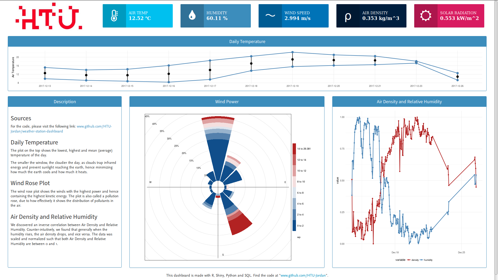

# Weather Station Dashboard

## Overview
We have a weather station atop the main building at HTU. We decided to take the data feed and create a simple real-time / pseudo real-time dashboard that represents the data in an intuitive way and gives insight into our weather conditions.

__Note:__ All IP addresses, database users and passwords have been replaced with * for security purposes.

## Technologies

- __R__ for data analyses and visualizations
- __Shiny__ for dashboard Server logic and UI
- __HTML__ for design
- __CSS__ for design
- __Python__ for initializing and updating the database
- __SQL__ for database
- __LoggerNet (CRBasic)__ for the weather station connection

## Folder Structure
Stylesheet, logo, font and footer files are place in the `www` folder. Shiny readily accepts them in this directory.

## Source Code Explanation
- `global.R`  
Contains static logic for the dashboard as well as library imports.

- `app.R`  
Main dashboard source file, contains all UI and Server logic.

- `ws_db.sql`    
Creates database schema.

- `init_wsDB.py`  
Populate the database.

- `update_wsDB.py`  
Update the database on change in output tables from weather station.

- `run.bat`, `run_dashboard.sh`, and `run_db script.sh`   
Windows and Linux scripts to run the dashboard by broadcasting to an IP address and run the database update script

- `www\style.css`  
CSS design stylesheet for the dashboard.

